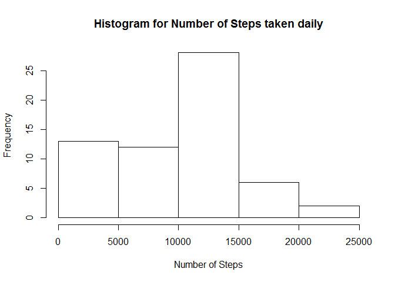
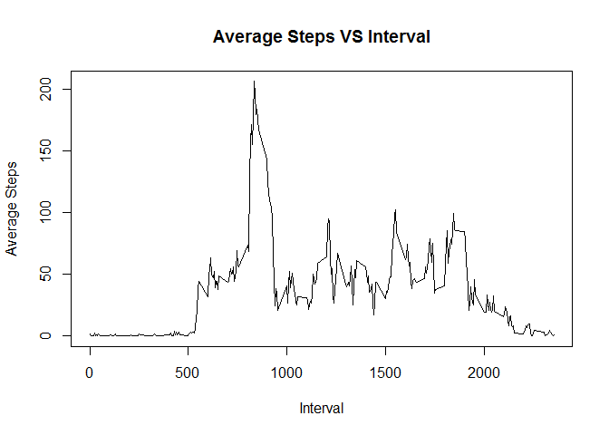
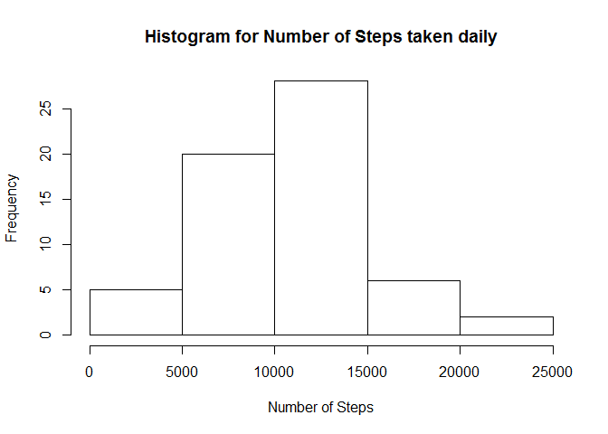
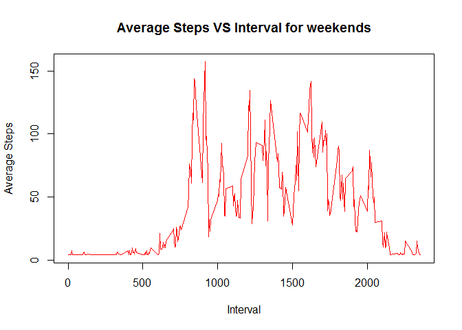
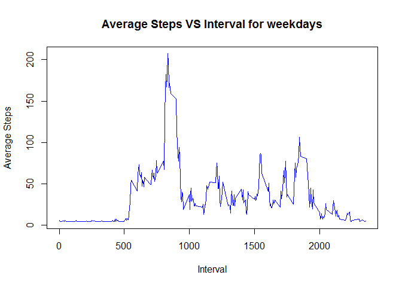

# PA1_template
Aroma Rodrigues  
5 February 2017  

This is an R Markdown document. Markdown is a simple formatting syntax for authoring HTML, PDF, and MS Word documents. For more details on using R Markdown see <http://rmarkdown.rstudio.com>.

This is where we input the data from it's csv format and look at it's dataframe format.


```r
df<-read.csv("activity.csv")
head(df)
```

```
##   steps       date interval
## 1    NA 2012-10-01        0
## 2    NA 2012-10-01        5
## 3    NA 2012-10-01       10
## 4    NA 2012-10-01       15
## 5    NA 2012-10-01       20
## 6    NA 2012-10-01       25
```

Processing of data into a new data frame to incorporate total number of steps with respect to the day.


```r
dt<-data.frame((matrix(ncol=2,nrow = length(unique(df$date)))))
dt[,1]<-unique(df$date)
for(i in 1:nrow(dt))
{
  c1<-df[df[,"date"]==dt[i,1],]
  dt[i,2]<-sum(c1$steps,na.rm=TRUE)
}
head(dt)
```

```
##           X1    X2
## 1 2012-10-01     0
## 2 2012-10-02   126
## 3 2012-10-03 11352
## 4 2012-10-04 12116
## 5 2012-10-05 13294
## 6 2012-10-06 15420
```

Displaying Histogram, mean and median of number of steps


```r
hist(dt$X2, main="Histogram for Number of Steps taken daily", 
     xlab="Number of Steps",)
```

<!-- -->

```r
rp<-mean(dt$X2, na.rm=TRUE)
rp
```

```
## [1] 9354.23
```

```r
median(dt$X2, na.rm=TRUE)
```

```
## [1] 10395
```

Processing data to average number of steps across 5 minute intervals everyday. 


```r
dt1<-data.frame((matrix(ncol=2,nrow = length(unique(df$interval)))))
dt1[,1]<-unique(df$interval)
for(i in 1:nrow(dt1))
{
  c1<-df[df[,"interval"]==dt1[i,1],]
  dt1[i,2]<-mean(c1$steps,na.rm=TRUE)
}
head(dt1)
```

```
##   X1        X2
## 1  0 1.7169811
## 2  5 0.3396226
## 3 10 0.1320755
## 4 15 0.1509434
## 5 20 0.0754717
## 6 25 2.0943396
```

Plotting a line curve for average steps vs interval

<!-- -->

As we can see the interval between 750-1000 has the most activity

Calculating number of NA values and replacing them with mean wrt days.


```r
sum(is.na(df$steps)) 
```

```
## [1] 2304
```

Processing to replace NA with mean wrt days. Since steps is wrt interval too we proceed to take a mean wrt both days and mean.


```r
rp<-rp/288
rp
```

```
## [1] 32.47996
```

```r
df[["steps"]][is.na(df[["steps"]])] <- rp
```

Displaying Histogram, calculating mean and median


```r
dt2<-data.frame((matrix(ncol=2,nrow = length(unique(df$date)))))
dt2[,1]<-unique(df$date)
for(i in 1:nrow(dt))
{
  c1<-df[df[,"date"]==dt2[i,1],]
  dt2[i,2]<-sum(c1$steps,na.rm=TRUE)
}
head(dt2)
```

```
##           X1       X2
## 1 2012-10-01  9354.23
## 2 2012-10-02   126.00
## 3 2012-10-03 11352.00
## 4 2012-10-04 12116.00
## 5 2012-10-05 13294.00
## 6 2012-10-06 15420.00
```

```r
hist(dt2$X2, main="Histogram for Number of Steps taken daily", 
     xlab="Number of Steps",)
```

<!-- -->

```r
mean(dt2$X2, na.rm=TRUE)
```

```
## [1] 10581.01
```

```r
median(dt2$X2, na.rm=TRUE)
```

```
## [1] 10395
```

Comparing to the first histograms we note the difference


```r
df1<-data.frame((matrix(ncol=4,nrow = nrow(df))))
df1$X1<-df$steps
df1$X2<-df$date
df1$X3<-df$interval
df1$X4<-(weekdays(as.Date(df$date))=="Sunday" | weekdays(as.Date(df$date))=="Saturday")
df_end<-data.frame((matrix(ncol=4,nrow = nrow(df))))
df_end<-df1[df1[,4]=="TRUE",]
df_week<-df1[df1[,4]=="FALSE",]


d1<-data.frame((matrix(ncol=2,nrow = length(unique(df$interval)))))
d2<-data.frame((matrix(ncol=2,nrow = length(unique(df$interval)))))
d1[,1]<-unique(df$interval)
for(i in 1:nrow(d1))
{
  c1<-df_end[df_end[,3]==d1[i,1],]
  d1[i,2]<-mean(c1$X1,na.rm=TRUE)
}
head(d1)
```

```
##   X1       X2
## 1  0 4.059995
## 2  5 4.059995
## 3 10 4.059995
## 4 15 4.059995
## 5 20 4.059995
## 6 25 7.309995
```

```r
d2[,1]<-unique(df$interval)
for(i in 1:nrow(d2))
{
  c1<-df_week[df_week[,3]==d2[i,1],]
  d2[i,2]<-mean(c1$X1,na.rm=TRUE)
}
head(d2)
```

```
##   X1       X2
## 1  0 6.352884
## 2  5 4.730662
## 3 10 4.486217
## 4 15 4.508440
## 5 20 4.419551
## 6 25 5.641773
```

Plotting 

<!-- --><!-- -->
